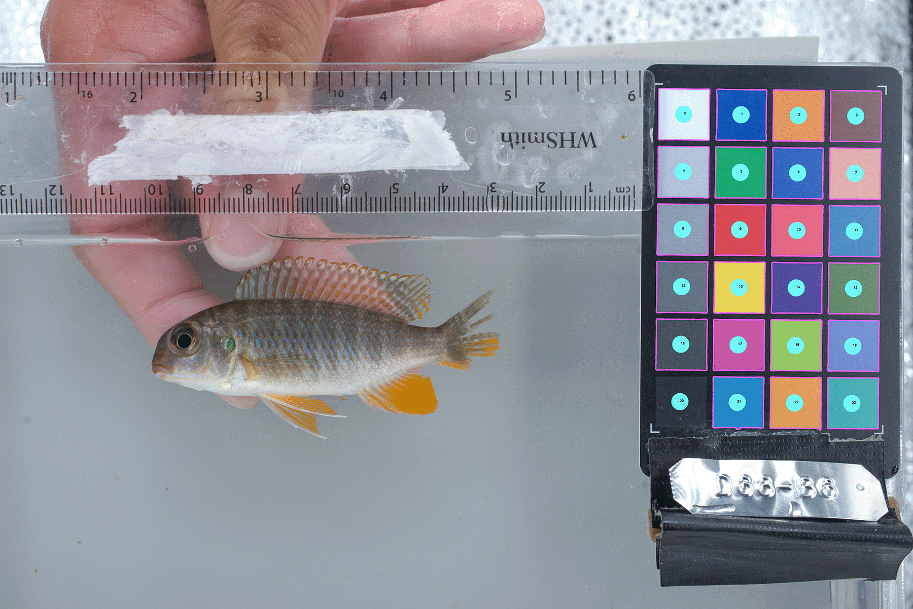

# _Automated color and exposure correction based on color card_

Batch-correct color and exposure among a set of RAW (e.g. .ARW, .NEF, .CR3) images that all contain the same color card. One image is used to extract a reference color matrix,  all images are then read one by one and corrections are applied to match the reference color matrix. **All images must contain a 24 patch color card like the Calibrite ColorChecker Classic Mini, but cheaper models work as well as long as the same card is consistently used**.


**Fig. 1**: Example image with a color card (auto-detected with PlantCV). 

<br />
<br />

## Dependencies
[PlantCV](https://github.com/danforthcenter/plantcv) is used to detect the color card, to extract color matrices and to apply corrections. [Rawpy](https://github.com/letmaik/rawpy) is used to read in RAW files and [Pillow](https://github.com/python-pillow/Pillow) to write output TIFFs. [OpenCV](https://github.com/opencv/opencv) is used to rearrange color channels in the scripts and PlantCV heavily relies on OpenCV.

All dependencies can be installed with conda/mamba:

```
mamba install -c conda-forge plantcv opencv rawpy pillow 
```
<br />
<br />

## Workflow example

###  Step 1:  Set up working directories for batch correction

Set up three directories: one containing the RAW images to be corrected (e.g. "raw"), one where ```batch_correct.py``` will save the color and exposure-corrected output TIFF files (e.g. "tiff") and one where a PNG image with a visualization of the color card detection (see Fig. 1) will be saved per input file (e.g. "review"). The purpose of the PNG images written to the review directory is to manually check that the color card was detected correctly in each image. 

Below is an exemplary directory structure:
```
├── raw
│   ├── image_01.ARW
│   ├── image_02.ARW
│   ├── image_03.ARW
│   ├── image_04.ARW
│   └── image_05.ARW
├── tiff
└── review
```
<br />

###  Step 2:  Batch correct color and exposure

Execute ```batch_correct.py```, which expects 6 positional argunments:

```
  <input_dir_path>    Path to the input directory containing RAW files
  <output_dir_path>   Path to the output directory which to which color-corrected TIFF files will be saved
  <review_dir_path>   Path to the PlantCV debug directory which will contain PNGs with the masked color card for review
  <ref_image_path>    Path to the a single RAW image that will serve as the reference for all input RAW files
  <raw_suffix>        RAW suffix used, this could be "ARW" (Sony), "NEF" (Nikon), "CR3" (Canon) or others (check rawpy)
  <icc_profile_path>  Path to the ICC color profile to be embedded in the output TIFFs, for example the supplied sRGB profile: data/sRGB_profile.icc
```

Every RAW image in ```<input_dir_path>``` will be processed. The color card detection attempts to identify the 24 square color patches on the card and then to fit a 4x6 grid and sample from the center of each grid cell. That means that even if not all patches are recognized, the color sampling can be successful if a grid can be fitted (see Fig. 1, where the bottom left grid was not detected but it is was still sampled). The images in ```<review_dir_path>``` will give an idea how reliable the color card detection works. If not satisfactory, adjusting the detection parameters in ```batch_correct.py``` (which will be passed on to PlantCV's ```transform.detect_color_card()``` function) can have a big impact:

```
## PLANTCV CONFIG

# adjust variable for card detection
ADAPTIVE_METHOD = 0
BLOCK_SIZE = 101
RADIUS = 50
MIN_SIZE = 20000
```

It is worth comparing the performance of the two ```ADAPTIVE_METHOD``` options (```0``` = *mean*, ```1``` = *Gaussian*) and to try out other values for ```BLOCK_SIZE```(must be uneven). ```RADIUS``` (in pixels) determines the size of the circular sampling area in each patch (see Fig. 1) and the ```MIN_SIZE``` threshold determines the minimum area of a the individual color patch (in pixels) to be detectable. This can be estimated by counting the width of a patch in pixels and multiplying it by 2, but make sure to set a threshold that is slightly below the observed patch size to account for variation between images. 
```<ref_image_path>``` specifies a single RAW image (this can be one from ```<input_dir_path>```) that will serve as the reference for all other images ton inform color and exposure corrections. ```<icc_profile_path>``` specifies an [color profile](https://en.wikipedia.org/wiki/ICC_profile) to be embedded in the output TIFF files. Often, the supplied profile (```data/sRGB_profile.icc```) will suffice.

If automated detection/correction fails for some images, consider step 3.


<br />

###  Step 3:  Fix individual images if automated color correction failed [optional]

Sometimes a *target image* lacks a color card or the card might be partially covered and autodetection fails. If that is the case, one can use another image from the same series as a *proxy* to infer color corrections. ```correct_from_proxy.py``` does exactly that, it takes a ```target image``` but uses a ```proxy image``` (e.g. the next image in the series with successful card detection) to infer the corrections required relative to the same ```reference image``` used in ```batch_correct.py```. The corrections are then applied to the ```target image```. This allows to fix individual images where the batch correction workflow was not successful.

Usage of ```correct_from_proxy.py```:

```
  <target_image_path>  Path to the RAW image to apply corrections to
  <proxy_image_path>   Path to the (proxy) RAW image used to infer corrections from
  <ref_image_path>     Path to the RAW image serving as the reference for for color correction
  <output_path>        Path to the color-corrected output TIFF
  <review_dir_path>    Path to the PlantCV debug directory which will contain PNGs with the masked color card for review
  <icc_profile_path>   Path to the ICC color profile to be embedded in the output TIFFs, for example the supplied sRGB
                       profile: data/sRGB_profile.icc
```

```correct_from_proxy.py``` also contains a CONFIG block where the PlantCV detection parameters can be adjusted.


<br />

###  Further processing: [optional] 

The produced TIFF files are color and exposure corrected. Further adjustments may now be applied to all photos using standard image processing software, e.g. using Lightroom presets. 
Please not that: 
(1) metadata (EXIF, e.g. aperture, shutter speed, ISO) from the RAW files are not retained in the TIFFs
(2) The output TIFF files are uncompressed.

To convert TIFF files to compressed (lossless!) PNG files and to reannotate them with the original metadata, I recommend using [ImageMagick](https://imagemagick.org/index.php) and [exiftool](https://exiftool.org). Both can be installed with conda/mamba (```conda install -c conda-forge imagemagick exiftool```). The following BASH loop may be used to convert TIFF files to compressed (lossless) PNGs and reannotate them with the metadata from the RAW files:

```
mkdir -p png

RAW_DIR=raw    # directory containing RAW files
TIF_DIR=tiff   # directory containing corrected TIFF files
PNG_DIR=png    # new directory for compressed PNG files
RAW_SUFFIX=ARW # RAW file suffix, e.g. ARW, NEF, CR3

for FILE_PATH in $(find $TIF_DIR -type f -name "*.tiff" | sort) ; do
  FILE_NAME=$(echo $FILE_PATH | rev | cut -d '/' -f-1 | cut -d '.' -f2- | rev)
  magick ${TIF_DIR}/${FILE_NAME}.tiff -define png:compression-level=6 ${PNG_DIR}/${FILE_NAME}.png
  exiftool -overwrite_original -tagsFromFile ${RAW_DIR}/${FILE_NAME}.${RAW_SUFFIX} ${PNG_DIR}/${FILE_NAME}.png
done
```
<br />
<br />

## Contact

Moritz Blumer: lmb215@cam.ac.uk


